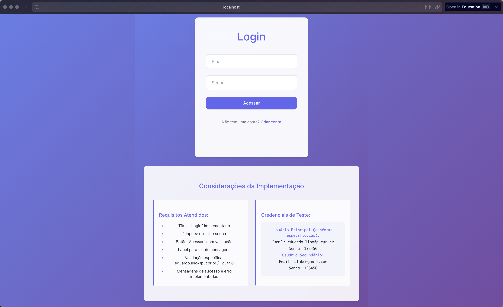
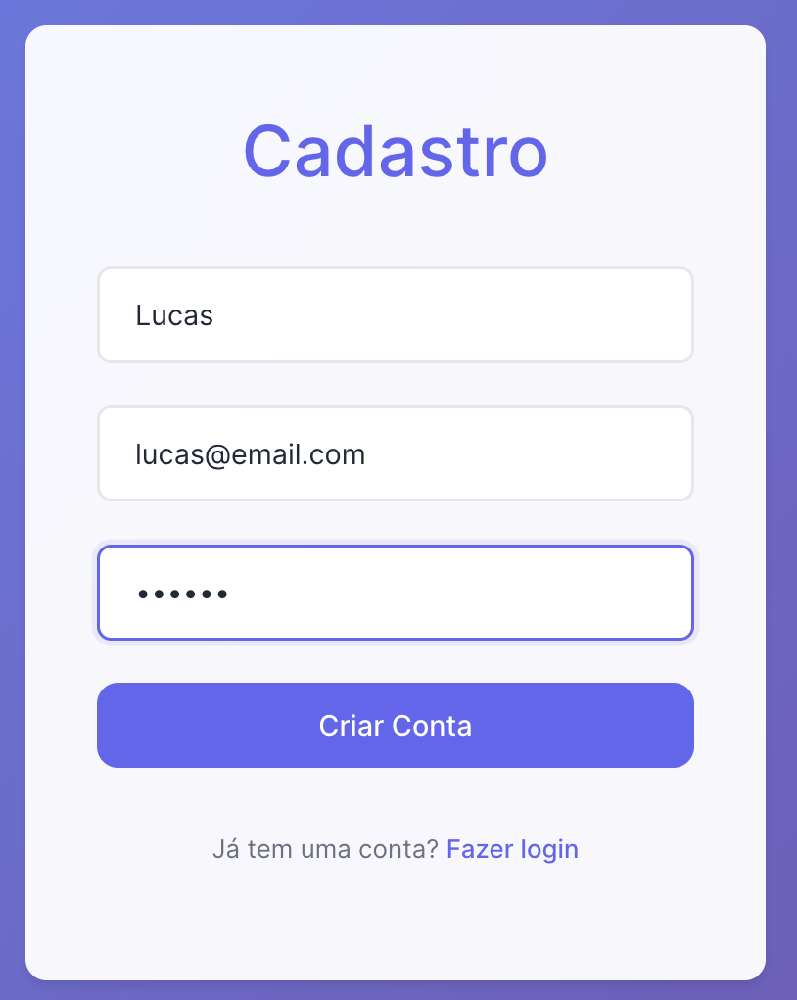

# Somativa 1 - TDW

> Projeto desenvolvido para a disciplina de **Tecnologias para Desenvolvimento Web**.

Aplicação React utilizando Vite, com telas de autenticação (login, cadastro) e dashboard.

## Como rodar o projeto

1. Instale as dependências:

```bash
npm install
```

2. Inicie o servidor de desenvolvimento:

```bash
npm run dev
```

3. Acesse em [http://localhost:5173](http://localhost:5173)

## Telas do Projeto

### Tela Inicial (Login)



### Tela de Cadastro



### Login com Validação e Erro de Autenticação


### Dashboard


---

Desenvolvido por Diogo Lucas de Oliveira.
